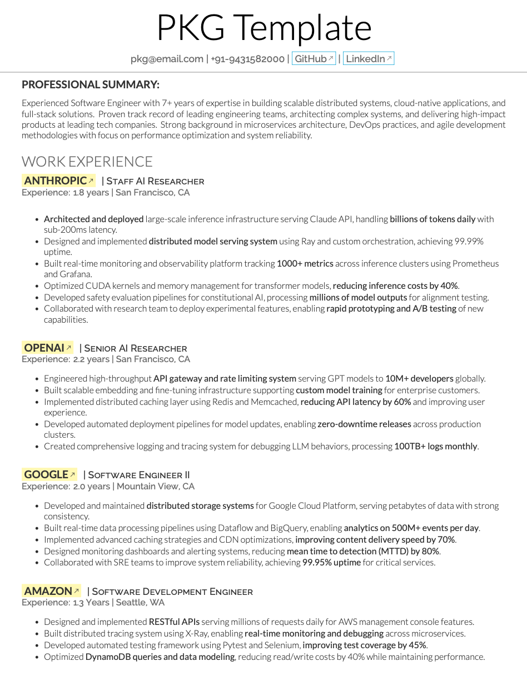
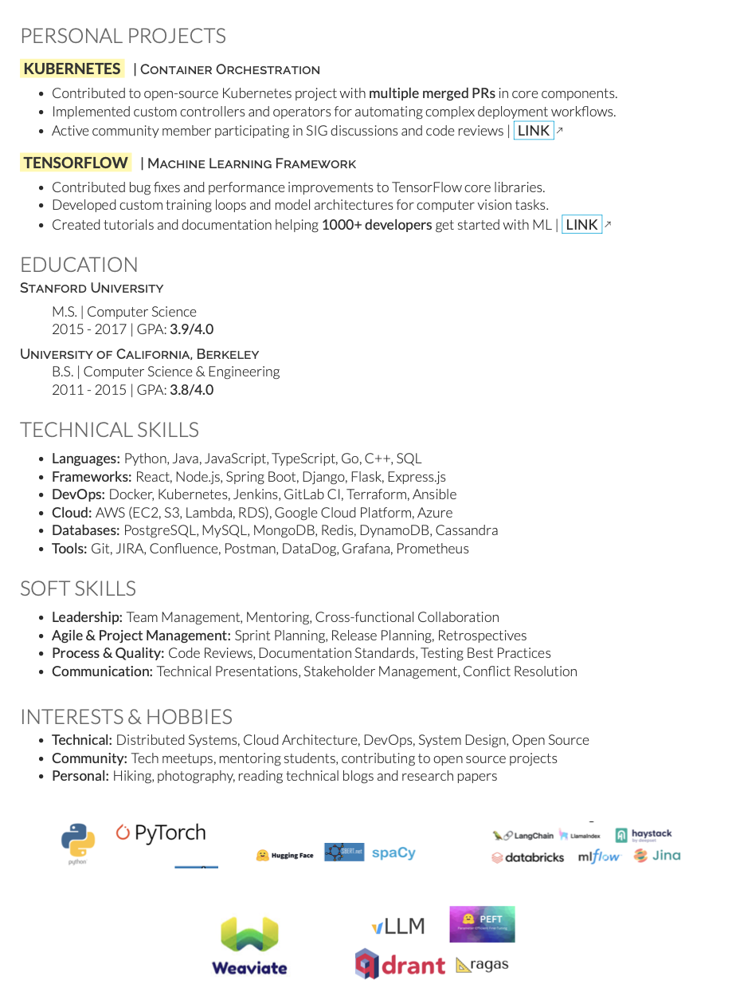

PKG-Resume
=========================

A **two-page**, **two asymmetric column** resume template in **XeTeX** built on top of [Deedy-Resume](https://github.com/deedydas/Deedy-Resume). This template is specifically designed for **senior engineers and above** who have extensive experience across multiple teams and companies.

## Why this resume format is important?

This resume template is ideal for:

1. **Senior engineer and above** who have worked across multiple teams/companies and have a lot to mention in their resume.
2. **Showing soft-skills and leadership experience** - The two-page format allows you to highlight leadership roles, mentoring experience, and cross-functional collaboration.
3. **Showing personal project / portfolio with links** - Dedicated space to showcase your personal projects, open-source contributions, and portfolio links.
4. **Adding logos for tech you worked on** to make it easily be understood by HR team (optional but advantageous) - Visual tech stack representation helps HR quickly identify relevant skills.

## Fonts

This template uses **OpenFonts** - free, open-source fonts that provide excellent readability:

- **Lato** (main font) - Used for body text, headings, and name section with various weights:
  - Lato-Lig (Light) - Main body text
  - Lato-Reg (Regular) - Bold text
  - Lato-Hai (Hairline) - Name section
  - Lato-Bol (Bold) - Subheadings
  - Lato-RegIta (Regular Italic) - Bold italic text
  - Lato-LigIta (Light Italic) - Italic text

- **Raleway** (sans-serif font) - Used for section headings, descriptors, and location:
  - Raleway-ExtraLight - Date and section headings
  - Raleway-Medium - Descriptors and location

All fonts are included in the `fonts/` directory and are freely available for use.

## Preview

### First Page

### Second Page

## Motivation

Common LaTeX resume-builders such as [**moderncv**](http://www.latextemplates.com/template/moderncv-cv-and-cover-letter)  and the [**friggeri-cv**](https://github.com/afriggeri/cv) look great if you're looking for a multi-page resume with numerous citations, but usually imperfect for making a thorough, single-page one. A lot of companies today search resumes based on [keywords](http://www.businessinsider.com/most-big-companies-have-a-tracking-system-that-scans-your-resume-for-keywords-2012-1) but at the same time require/prefer a one-page resume, especially for undergraduates. 

This template attempts to **look clean**, highlight **details**, be a **two-page format** suitable for experienced professionals, and allow useful **LaTeX templating**.

## Dependencies

1. Compiles only with **XeTeX** and required **BibTex** for compiling publications and the .bib filetype.
2. Uses open-source fonts (**Lato** and **Raleway**) that are freely available and work across all platforms (Windows, macOS, Linux).

## Availability

1. OpenFonts version - [as a direct download](https://github.com/deedydas/Deedy-Resume/raw/master/OpenFonts/deedy_resume-openfont.pdf)
2. **Overleaf**.com (formerly **WriteLatex**.com) (v1 fonts/colors changed) - [compilable online](https://www.writelatex.com/templates/deedy-resume/sqdbztjjghvz#.U2H9Kq1dV18)
3. **ShareLatex**.com (v1 fonts changes) - [compilable online](https://www.sharelatex.com/templates/cv-or-resume/deedy-resume)

## Changelog
### v1.2
 1. Added publications in place of societies.
 2. Collapsed a portion of education.
 3. Fixed a bug with alignment of overflowing long last updated dates on the top right. 

### v1.1
 1. Fixed several compilation bugs with \renewcommand
 2. Got Open-source fonts (Windows/Linux support)
 3. Added Last Updated
 4. Moved Title styling into .sty
 5. Commented .sty file.

## TODO
1. Merge OpenFont and MacFonts as a single sty with options.
2. Figure out a smoother way for the document to flow onto the next page.
3. Add styling information for a "Projects/Hacks" section.
4. Add location/address information
5. Fix the hacky 'References' omission outside the .cls file in the MacFonts version.
6. Add various styling and section options and allow for multiple pages smoothly.

## Known Issues:
1. Overflows onto second page if any column's contents are more than the vertical limit
2. Hacky space on the first bullet point on the second column.
3. Hacky redefinition of \refname to omit 'References' text for publications in the MacFonts version.

## License

This project is built on top of [Deedy-Resume](https://github.com/deedydas/Deedy-Resume) by Debarghya Das.

    Copyright 2014 Debarghya Das
    Copyright 2025 Prabhat Gupta

    Licensed under the Apache License, Version 2.0 (the "License");
    you may not use this file except in compliance with the License.
    You may obtain a copy of the License at

       http://www.apache.org/licenses/LICENSE-2.0

    Unless required by applicable law or agreed to in writing, software
    distributed under the License is distributed on an "AS IS" BASIS,
    WITHOUT WARRANTIES OR CONDITIONS OF ANY KIND, either express or implied.
    See the License for the specific language governing permissions and
    limitations under the License.
